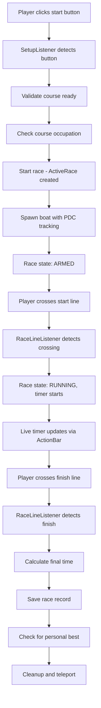
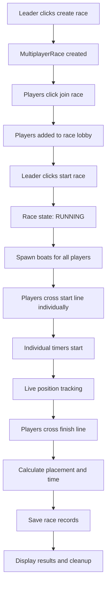
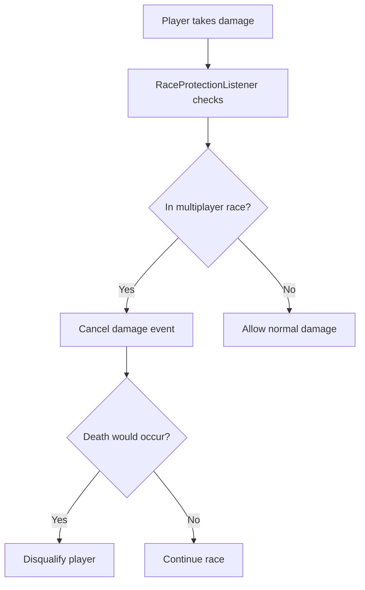
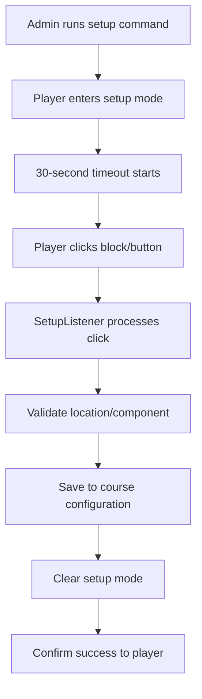

# 🏁 **BOCRacePlugin - Complete Blueprint & Design Document**

## 📋 **Overview**

BOCRacePlugin is a comprehensive **Minecraft boat racing plugin** designed for Paper 1.21.6+ servers. It provides both **singleplayer time trials** and **competitive multiplayer racing** with full statistics tracking, PlaceholderAPI integration, and advanced race management features.

### **Core Capabilities**
- **Dual Racing Modes**: Singleplayer time trials and multiplayer competitive races
- **Interactive Setup**: Button-based course configuration and race controls
- **Advanced Statistics**: Personal bests, leaderboards, completion rates, and DQ tracking
- **Player Protection**: Comprehensive safety systems during races
- **Visual Integration**: PlaceholderAPI support for holograms and displays
- **Course Customization**: Per-course boat types, sounds, and settings

---

## 🛠️ **Development Environment**

### **Technical Stack**
- **Minecraft Version**: Paper 1.21.6
- **Java Version**: 21
- **Build System**: Maven 3.6+
- **Dependencies**: PlaceholderAPI 2.11.6, Adventure API 4.17.0

### **Repository Information**
- **GitHub URL**: `https://github.com/AbnVet/MCRacePlugin.git`
- **Branch**: `main`
- **Build Command**: `mvn package -q`
- **JAR Output**: `target/BOCRacePlugin-1.0.0.jar`

### **Project Structure**
```
BOCRacePlugin/
├── src/main/java/com/bocrace/
│   ├── BOCRacePlugin.java              # Main plugin class
│   ├── command/                        # Command handlers
│   ├── config/                         # Configuration management
│   ├── integration/                    # PlaceholderAPI integration
│   ├── listener/                       # Event listeners
│   ├── model/                          # Data models
│   ├── race/                           # Race management
│   ├── storage/                        # Data persistence
│   └── util/                           # Utility classes
├── src/main/resources/
│   ├── config.yml                      # Plugin configuration
│   ├── messages.yml                    # Custom messages
│   └── plugin.yml                      # Bukkit plugin metadata
└── pom.xml                             # Maven configuration
```

---

## 🎮 **Commands**

### **Primary Commands**

#### **`/bocrace` - Main Plugin Command**
```bash
# Global Commands
/bocrace help                           # Show command help
/bocrace reload                         # Reload configs and courses
/bocrace debugcourses                   # Debug course information

# Singleplayer Commands
/bocrace singleplayer create <name>     # Create new singleplayer course
/bocrace singleplayer setup <name>      # Interactive course setup
/bocrace singleplayer delete <name>     # Delete course
/bocrace singleplayer list              # List all singleplayer courses
/bocrace singleplayer tp <name>         # Teleport to course lobby
/bocrace singleplayer info <name>       # Show course information

# Multiplayer Commands
/bocrace multiplayer create <name>      # Create new multiplayer course
/bocrace multiplayer setup <name>       # Interactive course setup
/bocrace multiplayer delete <name>      # Delete course
/bocrace multiplayer list               # List all multiplayer courses
/bocrace multiplayer tp <name>          # Teleport to race lobby
/bocrace multiplayer info <name>        # Show course information
/bocrace multiplayer stats <name>       # Show course leaderboards
/bocrace multiplayer recent <name>      # Show recent race results
```

#### **`/racestats` - Player Statistics**
```bash
/racestats help                         # Show statistics help
/racestats [player]                     # Show player race statistics
```

### **Setup Commands**

#### **Singleplayer Course Setup**
```bash
/bocrace singleplayer setup <course> setmainlobbybutton     # Main lobby start button
/bocrace singleplayer setup <course> setcourselobbybutton   # Course lobby start button
/bocrace singleplayer setup <course> setboatspawn           # Boat spawn location
/bocrace singleplayer setup <course> setboattype <type>     # Boat type (oak, cherry, bamboo, etc.)
/bocrace singleplayer setup <course> setstartlinepoints <1|2>  # Start line detection
/bocrace singleplayer setup <course> setfinishlinepoints <1|2> # Finish line detection
/bocrace singleplayer setup <course> setreturnmainbutton    # Return/restart button
/bocrace singleplayer setup <course> setcourselobbyspawn    # Course lobby spawn
/bocrace singleplayer setup <course> setmainlobbyspawn      # Main lobby spawn
```

#### **Multiplayer Course Setup**
```bash
/bocrace multiplayer setup <course> setmpracelobbyspawn     # Race lobby spawn point
/bocrace multiplayer setup <course> setmpcreateracebutton   # Create race button
/bocrace multiplayer setup <course> setmpstartracebutton    # Start race button
/bocrace multiplayer setup <course> setmpjoinracebutton     # Join race button
/bocrace multiplayer setup <course> setmpcancelracebutton   # Cancel race button
/bocrace multiplayer setup <course> setmpreturnbutton       # Return to lobby button
/bocrace multiplayer setup <course> setmpboatspawn <1-10>   # Boat spawn points (up to 10)
/bocrace multiplayer setup <course> setstartlinepoints <1|2>   # Start line detection
/bocrace multiplayer setup <course> setfinishlinepoints <1|2>  # Finish line detection
```

---

## ⭐ **Core Features**

### **🏁 Singleplayer Racing**
- **Time Trials**: Individual races with personal best tracking
- **Button Controls**: Physical buttons for race start and return
- **Lobby System**: Main lobby and course-specific lobby support
- **Course Occupation**: Prevents multiple players on same course
- **Safety Teleports**: Smart teleportation based on button usage

### **🎯 Multiplayer Racing**
- **Competitive Racing**: Up to 10 players per race
- **Session Management**: Race creation, joining, and lifecycle management
- **Live Leaderboards**: Real-time position tracking during races
- **Server Announcements**: Broadcast race events to entire server
- **Timeout System**: Automatic race timeout with DQ handling

### **🛡️ Player Protection**
- **Damage Immunity**: Protection from mobs, PvP, explosions during races
- **Drowning Prevention**: Players can't drown during races
- **Boat Protection**: Race boats can't be destroyed
- **Smart Cleanup**: Handles disconnects and boat exits gracefully

### **📊 Statistics & Analytics**
- **Personal Bests**: Individual course records with timestamps
- **Leaderboards**: Top 10 rankings per course with medal display
- **Usage Tracking**: Course popularity and usage statistics
- **DQ Analytics**: Disqualification tracking and completion rates
- **Recent Races**: Player race history with detailed results

### **🎨 PlaceholderAPI Integration**
- **25+ Placeholders**: Comprehensive race data for holograms
- **Live Timers**: Real-time race timing displays
- **Course Information**: Status, records, usage statistics
- **Player Stats**: Personal bests, completion rates, DQ tracking
- **Global Statistics**: Server-wide race metrics

### **🚤 Course Customization**
- **Boat Types**: 9 different boat types (oak, cherry, bamboo, etc.)
- **Sound Effects**: Configurable race sounds and effects
- **Custom Messages**: Per-course message overrides
- **Visual Effects**: Particle effects for race events

---

## 🏗️ **Classes & Responsibilities**

### **Core Plugin Architecture**

#### **`BOCRacePlugin.java` (283 lines)**
- **Main plugin class** extending JavaPlugin
- **Dependency injection** for all managers and utilities
- **Emergency cleanup** system for plugin shutdown
- **Setup mode tracking** with 30-second timeout
- **Debug logging** with multiple debug levels

#### **`ConfigManager.java` (209 lines)**
- **Configuration management** for config.yml and messages.yml
- **Auto-migration** for plugin updates
- **Debug mode control** (general, race, setup, multiplayer)
- **Settings validation** and defaults

### **Command System**

#### **`BOCRaceCommand.java` (1,392 lines)**
- **Primary command handler** for all /bocrace commands
- **Tab completion** support for all subcommands
- **Singleplayer management** (create, setup, delete, list, tp, info)
- **Multiplayer management** (create, setup, delete, list, tp, info, stats)
- **Interactive setup** mode coordination

#### **`RaceStatsCommand.java`**
- **Player statistics** command handler
- **Race history** and personal best displays

### **Race Management**

#### **`RaceManager.java` (225 lines)**
- **Singleplayer race** lifecycle management
- **Active race tracking** with concurrent safety
- **Course occupation** prevention
- **Race state management** (ARMED, RUNNING, FINISHED, DQ)
- **Cleanup and timeout** handling

#### **`MultiplayerRaceManager.java` (737 lines)**
- **Multiplayer race sessions** with up to 10 players
- **Race creation and joining** logic
- **Player position tracking** and live leaderboards
- **Timeout management** with configurable duration
- **DQ handling** with proper record saving

#### **`ActiveRace.java`**
- **Individual race session** data model
- **Timing calculations** with nanosecond precision
- **State tracking** and validation
- **Pre-race location** safety storage

#### **`MultiplayerRace.java`**
- **Multiplayer race session** data model
- **Player result tracking** with placement calculation
- **Race state management** (LOBBY, RUNNING, FINISHED, CANCELLED)
- **Boat spawn assignment** and management

### **Event Listeners**

#### **`RaceLineListener.java` (397 lines)**
- **Start/finish line detection** using VehicleMoveEvent
- **Precise timing** with nanosecond accuracy
- **Both singleplayer and multiplayer** race handling
- **Live timer updates** via ActionBar

#### **`SetupListener.java` (463 lines)**
- **Interactive course setup** via block clicking
- **Button detection** for race controls
- **Setup mode management** with timeout
- **Race initiation** for singleplayer courses

#### **`MultiplayerButtonListener.java`**
- **Multiplayer button interactions** (create, join, start, cancel)
- **Race session management** via button presses
- **Redstone integration** for start button
- **Permission validation** for race creation

#### **`RaceCleanupListener.java` (242 lines)**
- **Player disconnect handling** during races
- **Boat exit detection** and DQ logic
- **Emergency teleportation** and cleanup
- **DQ record saving** with reasons

#### **`RaceProtectionListener.java`**
- **Damage prevention** during multiplayer races
- **Death handling** with DQ logic
- **Effect management** (night vision, protection)
- **Boat damage prevention**

### **Data Models**

#### **`Course.java` (298 lines)**
- **Course configuration** data model
- **Location storage** for all course components
- **Usage tracking** and statistics
- **Per-course settings** (sounds, particles, boat types)
- **Both singleplayer and multiplayer** support

#### **`RaceRecord.java`**
- **Race result** data model
- **Player name, course, time, date** tracking
- **Course type** differentiation
- **Formatted display** methods

#### **`CourseType.java`**
- **Enumeration** for SINGLEPLAYER and MULTIPLAYER courses

### **Storage System**

#### **`StorageManager.java` (451 lines)**
- **Course persistence** to YAML files
- **Directory structure** management
- **Course loading and saving** with validation
- **Location serialization** and deserialization

#### **`YAMLRecordManager.java` (398 lines)**
- **Race record persistence** to YAML files
- **Player statistics** tracking and storage
- **Leaderboard generation** and ranking
- **Recent race history** management

#### **`RecordManager.java` (Interface)**
- **Data access interface** for future MySQL migration
- **Standardized methods** for record operations
- **Type safety** and consistency

### **Utility Classes**

#### **`BoatManager.java` (272 lines)**
- **Race boat spawning** with PDC tracking
- **Boat type parsing** and validation
- **Boat cleanup** and removal
- **Player-boat association** management

#### **`TeleportUtil.java`**
- **Safe teleportation** with location validation
- **Emergency teleport** system
- **Lobby teleportation** with fallback logic

#### **`LineDetection.java`**
- **Start/finish line** collision detection
- **Forgiving zone detection** for better UX
- **Coordinate mathematics** for line crossing

#### **`SoundEffectManager.java`**
- **Race sound effects** management
- **Configurable audio** feedback
- **Event-based audio** triggers

#### **`PDCKeys.java`**
- **PersistentDataContainer** key management
- **Boat tagging** and identification
- **Race state tracking** on entities

### **Integration**

#### **`BOCRacePlaceholderExpansion.java` (623 lines)**
- **PlaceholderAPI expansion** with 25+ placeholders
- **Real-time race data** for holograms
- **Player statistics** and course information
- **DQ analytics** and completion rates

---

## ⚙️ **Configuration Structure**

### **`config.yml` - Main Configuration**

```yaml
# Race Settings
race-timeout: 60                        # Singleplayer race timeout (seconds)

# Multiplayer Configuration
multiplayer:
  race-timeout: 300                      # Multiplayer race timeout (seconds)
  max-join-players: 9                    # Maximum players (leader takes 10th slot)
  
  # Server Announcements
  announcements:
    race-created: "&6{player} &eis starting a multiplayer race on &a{course}&e!"
    race-started: "&aRace started on &6{course}&a! &7({players} racers)"
    race-finished: "&6Race completed on &a{course}&6! Results posted."
    race-timeout: "&cRace on &6{course} &chas timed out! Unfinished players disqualified."
  
  # Player Protection
  player-protection:
    enabled: true
    prevent-mob-damage: true
    prevent-pvp: true
    prevent-explosion-damage: true
    prevent-drowning: true
    prevent-fall-damage: false           # Allow course obstacles
    prevent-item-drops: true
    death-disqualifies: true
    protect-boats: true
  
  # Race Effects
  effects:
    night-vision:
      enabled: false                     # Disabled by default
      duration: 600                      # 10 minutes in seconds

# Audio/Visual Settings
sounds:
  enabled: true
  race-start: "BLOCK_NOTE_BLOCK_BELL"
  race-finish: "ENTITY_PLAYER_LEVELUP"
  personal-best: "UI_TOAST_CHALLENGE_COMPLETE"
  boat-spawn: "ENTITY_BOAT_PADDLE_WATER"
  setup-success: "ENTITY_EXPERIENCE_ORB_PICKUP"
  setup-enter: "BLOCK_NOTE_BLOCK_PLING"
  error: "ENTITY_VILLAGER_NO"

particles:
  enabled: true
  race-start: "FIREWORK"
  race-finish: "VILLAGER_HAPPY"
  boat-spawn: "SPLASH"
  setup-success: "VILLAGER_HAPPY"

# Debug Modes
debug: false                             # General debug logging
debug-race: false                        # Race mechanics debug
debug-setup: false                       # Course setup debug
debug-multiplayer: false                 # Multiplayer race debug

# Timer Display
timer:
  display-mode: "actionbar"              # Live timer display method
  update-interval: 100                   # Update frequency (milliseconds)
```

### **`messages.yml` - Custom Messages**

```yaml
prefix: "[BOCRace] "

messages:
  course-created: "Course created successfully."
  course-deleted: "Course deleted successfully."
  course-not-found: "Error: Course not found."
  multiplayer-start: "%player% is starting a multiplayer race! Visit NPC at spawn."
```

### **Per-Course Configuration**

Each course can override global settings:

```yaml
# Example: CoyoteSixTest1.yml
name: CoyoteSixTest1
type: SINGLEPLAYER
boat-type: "CHERRY"                      # Course-specific boat type
sounds-enabled: false                    # Override global sound setting
particles-enabled: true                  # Override global particle setting
custom-messages:
  race-start: "Custom start message!"    # Course-specific messages
```

---

## 🔄 **Event Flow**

### **Singleplayer Race Flow**



### **Multiplayer Race Flow**



### **Race Protection Flow**



### **Course Setup Flow**



---

## 💾 **Data Storage**

### **Directory Structure**
```
plugins/BOCRacePlugin/
├── config.yml                          # Main plugin configuration
├── messages.yml                        # Custom messages
├── courses/
│   ├── singleplayer/
│   │   ├── CoyoteSixTest1.yml          # Singleplayer course configs
│   │   └── ...
│   └── multiplayer/
│       ├── TestMP1234.yml              # Multiplayer course configs
│       └── ...
└── data/
    ├── singleplayer/
    │   ├── courses/
    │   │   ├── CoyoteSixTest1_records.yml    # Course-specific records
    │   │   └── ...
    │   └── players/
    │       ├── player_stats.yml         # Player statistics
    │       └── player_recent.yml        # Recent race history
    └── multiplayer/
        ├── courses/                     # Future multiplayer records
        └── players/                     # Future multiplayer stats
```

### **Data Formats**

#### **Course Records** (`*_records.yml`)
```yaml
records:
  record1:
    player: "Br0Cha0s"
    time: 9.849
    date: '2025-09-18 11:06:18'
    type: SINGLEPLAYER
  record2:
    player: "CoyoteSix (DQ - Exited boat)"  # DQ records with reasons
    time: -15.234                          # Negative time indicates DQ
    date: '2025-09-18 12:30:45'
    type: SINGLEPLAYER
```

#### **Player Statistics** (`player_stats.yml`)
```yaml
players:
  CoyoteSix:
    totalRaces: 55
    singleplayerRaces: 55
    multiplayerRaces: 0
    lastRaceDate: '2025-09-18 10:57:44'
```

#### **Player Recent Races** (`player_recent.yml`)
```yaml
players:
  CoyoteSix:
    recent:
      race1:
        course: CoyoteSixTest1
        time: 11.248
        date: '2025-09-18 10:57:04'
        type: SINGLEPLAYER
```

---

## 🎯 **PlaceholderAPI Integration**

### **Available Placeholders (25+)**

#### **Player-Specific Placeholders**
```
%bocrace_player_status%                 # Current racing status
%bocrace_player_current_time%           # Live race timer
%bocrace_player_course%                 # Current course name
%bocrace_player_position%               # Position in multiplayer race
%bocrace_player_races_completed%        # Total races completed
%bocrace_player_pb_<course>%            # Personal best on specific course
%bocrace_player_last_race_status%       # Last race result (completed/DQ)
%bocrace_player_dq_count%               # Total disqualifications
%bocrace_player_completion_rate%        # Success rate percentage
%bocrace_player_last_dq_reason%         # Reason for last DQ
```

#### **Course Information Placeholders**
```
%bocrace_course_<name>_status%          # Course availability
%bocrace_course_<name>_record%          # Record holder name
%bocrace_course_<name>_record_time%     # Record time
%bocrace_course_<name>_usage%           # Usage count
%bocrace_course_<name>_dq_rate%         # DQ rate percentage
```

#### **Leaderboard Placeholders**
```
%bocrace_leaderboard_<course>_<1-10>%   # Top 10 positions
```

#### **Multiplayer Race Placeholders**
```
%bocrace_mp_players_joined%             # Players in current race
%bocrace_mp_race_status%                # Race state
%bocrace_mp_time_remaining%             # Time until timeout
%bocrace_mp_leader%                     # Current leader name
%bocrace_mp_leader_time%                # Leader's time
```

#### **Global Statistics**
```
%bocrace_total_courses%                 # Total courses on server
%bocrace_active_races%                  # Active singleplayer races
%bocrace_active_mp_races%               # Active multiplayer races
```

### **DecentHolograms Integration Example**
```yaml
# Race Dashboard Hologram
- content: '&6&l🏁 RACE DASHBOARD'
- content: '&7Status: &e%bocrace_player_status%'
- content: '&7Current Time: &b%bocrace_player_current_time%'
- content: '&7Course Record: &a%bocrace_course_CoyoteSixTest1_record%'
- content: '&7Your PB: &6%bocrace_player_pb_CoyoteSixTest1%'
```

---

## 🔧 **Race Mechanics**

### **Line Detection System**
- **Start Line**: Thin plane detection using two coordinate points
- **Finish Line**: Forgiving cuboid zone (1.5 block expansion, 3 blocks up/1 down)
- **Collision Detection**: VehicleMoveEvent with from/to location comparison
- **State Validation**: Only detect when race is in appropriate state

### **Timing System**
- **Precision**: Nanosecond accuracy using `System.nanoTime()`
- **Display**: Live ActionBar updates every 100ms (10 FPS)
- **Format**: MM:SS.SSS for times under 1 hour
- **Storage**: Converted to seconds (double) for database storage

### **Boat Management**
- **PDC Tracking**: PersistentDataContainer for boat identification
- **Type Support**: 9 different boat types with fallback to oak
- **Spawn Logic**: Precise positioning with yaw/pitch from course config
- **Cleanup**: Automatic removal on race end or player disconnect

### **Player Safety**
- **Pre-race Location**: Stored before race starts for emergency teleport
- **Protection Systems**: Damage immunity, drowning prevention
- **Emergency Cleanup**: Handles plugin shutdown gracefully
- **Safe Teleportation**: Block positioning with +0.5 offset and +1.0 Y

---

## 🧪 **Testing Framework**

### **Race Interference Testing**
```bash
# Critical test sequence
1. Run singleplayer race on CoyoteSixTest1
2. Run multiplayer race on TestMP1234
3. Verify start line detection works
4. Verify finish line detection works
```

### **DQ Tracking Testing**
```bash
# Test DQ scenarios
1. Exit boat before race starts → Should allow rejoin
2. Exit boat during race → Should disqualify
3. Disconnect during race → Should save DQ record
4. Check placeholders show correct DQ data
```

### **Boat Type Testing**
```bash
# Test boat customization
/bocrace singleplayer setup CoyoteSixTest1 setboattype cherry
# Start race → Should spawn pink boats
/bocrace singleplayer info CoyoteSixTest1
# Should show: "Boat Type: cherry"
```

### **PlaceholderAPI Testing**
```bash
# Test placeholder functionality
/papi parse CoyoteSix %bocrace_player_status%
/papi parse CoyoteSix %bocrace_course_CoyoteSixTest1_record%
/papi parse CoyoteSix %bocrace_leaderboard_CoyoteSixTest1_1%
```

---

## 🚀 **Future Enhancements**

### **Immediate Improvements**
- [ ] **Singleplayer Race Timeout**: Implement timeout DQ for singleplayer races
- [ ] **Multiplayer Boat Types**: Extend boat type support to multiplayer courses
- [ ] **Enhanced DQ Reasons**: More detailed DQ reason tracking and storage
- [ ] **Rejoin Functionality**: Allow rejoining multiplayer races in lobby state

### **Advanced Features**
- [ ] **Permission System**: Granular permissions for course access
- [ ] **Course Categories**: Organize courses by difficulty or theme
- [ ] **Achievement System**: Unlock achievements for racing milestones
- [ ] **Tournament Mode**: Bracket-style competitive racing
- [ ] **Spectator Mode**: Allow spectating active races

### **Technical Improvements**
- [ ] **MySQL Migration**: Database backend for large servers
- [ ] **API Expansion**: Public API for other plugins
- [ ] **Performance Optimization**: Async operations for large datasets
- [ ] **Backup System**: Automatic course and data backups

### **User Experience**
- [ ] **GUI Interfaces**: In-game course management GUIs
- [ ] **Course Previews**: Minimap or overview displays
- [ ] **Race Replays**: Playback system for completed races
- [ ] **Social Features**: Friend challenges and head-to-head records

---

## 📊 **Performance Characteristics**

### **Memory Usage**
- **Active Races**: Minimal memory footprint with concurrent maps
- **Course Storage**: Lazy loading with on-demand file access
- **Statistics**: Efficient YAML-based storage with caching

### **Server Impact**
- **Event Handling**: Optimized listeners with early exits
- **Timer Updates**: Configurable update frequency (default 100ms)
- **Database Operations**: Async where possible to prevent lag

### **Scalability**
- **Course Limit**: No hard limit (file-system dependent)
- **Player Limit**: Designed for typical server populations
- **Record Storage**: Efficient pagination and limiting

---

## 🛡️ **Error Handling & Safety**

### **Graceful Degradation**
- **Missing Dependencies**: Continues without PlaceholderAPI if unavailable
- **Invalid Configurations**: Falls back to safe defaults
- **Corrupted Data**: Rebuilds from backup or defaults

### **Emergency Systems**
- **Plugin Shutdown**: Emergency player rescue and cleanup
- **Race Cleanup**: Automatic cleanup of stale race data
- **Boat Management**: Prevents boat entity leaks

### **Validation Systems**
- **Course Validation**: Ensures all required components are set
- **Location Safety**: Validates teleport destinations
- **Input Validation**: Sanitizes all user inputs

---

## 🎯 **Integration Points**

### **External Plugin Compatibility**
- **PlaceholderAPI**: Full expansion with 25+ placeholders
- **DecentHolograms**: Real-time race data display
- **WorldGuard**: Compatible with region protection
- **Essentials**: Works with teleportation and spawn systems

### **Bukkit API Usage**
- **Event System**: Comprehensive listener coverage
- **Scheduler**: Async tasks for timeouts and cleanup
- **PDC**: Modern data storage on entities
- **Adventure API**: Rich text formatting with MiniMessage

---

## 📈 **Metrics & Analytics**

### **Race Statistics**
- **Completion Rates**: Track player success rates
- **Course Difficulty**: Analyze DQ rates per course
- **Usage Patterns**: Monitor popular courses and times
- **Performance Metrics**: Track race times and improvements

### **Server Analytics**
- **Active Races**: Monitor concurrent race activity
- **Player Engagement**: Track racing frequency and retention
- **Course Popularity**: Identify most-used courses
- **Error Rates**: Monitor DQ causes and frequencies

---

## 🏆 **Production Readiness**

### **Deployment Checklist**
- ✅ **Comprehensive error handling** throughout codebase
- ✅ **Thread-safe operations** with concurrent data structures
- ✅ **Memory management** with proper cleanup systems
- ✅ **Configuration validation** with safe defaults
- ✅ **Emergency systems** for graceful failure handling

### **Monitoring & Maintenance**
- **Debug Modes**: Multiple debug levels for troubleshooting
- **Performance Logging**: Configurable logging levels
- **Health Checks**: Built-in validation and diagnostic commands
- **Hot Reload**: Configuration changes without restart

---

**BOCRacePlugin represents a professional-grade Minecraft plugin with enterprise-level architecture, comprehensive feature coverage, and production-ready deployment capabilities.** 🏁

*Last Updated: September 2025 - Plugin Version 1.0.0*
